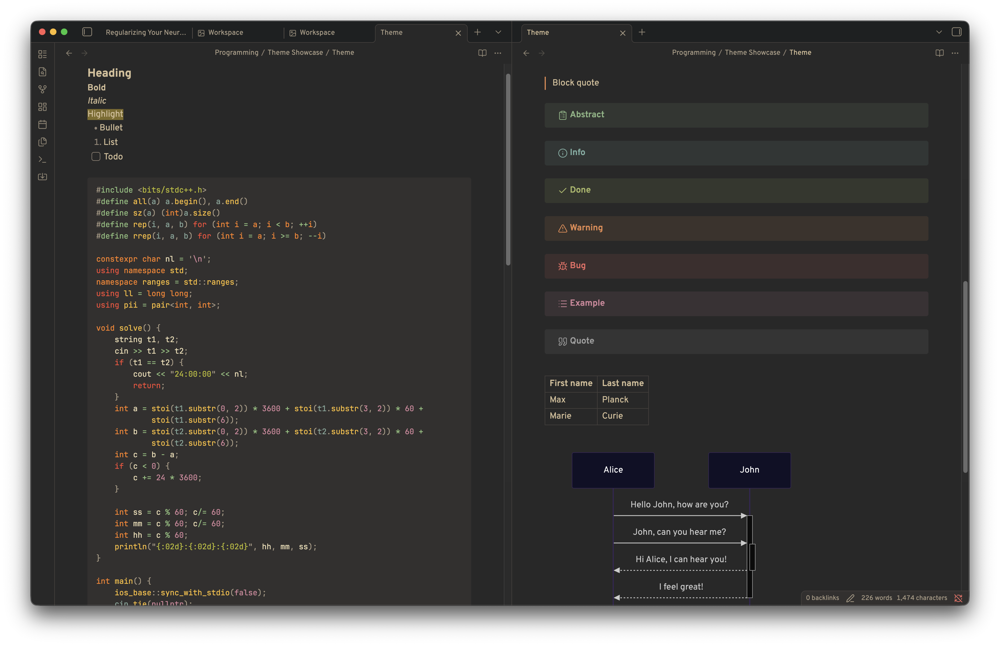
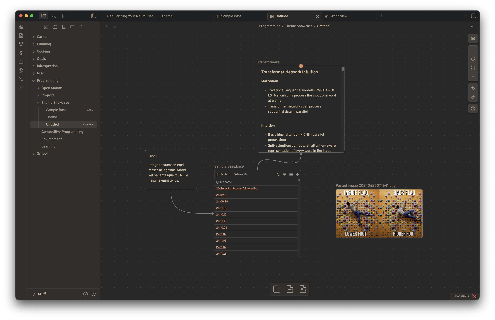
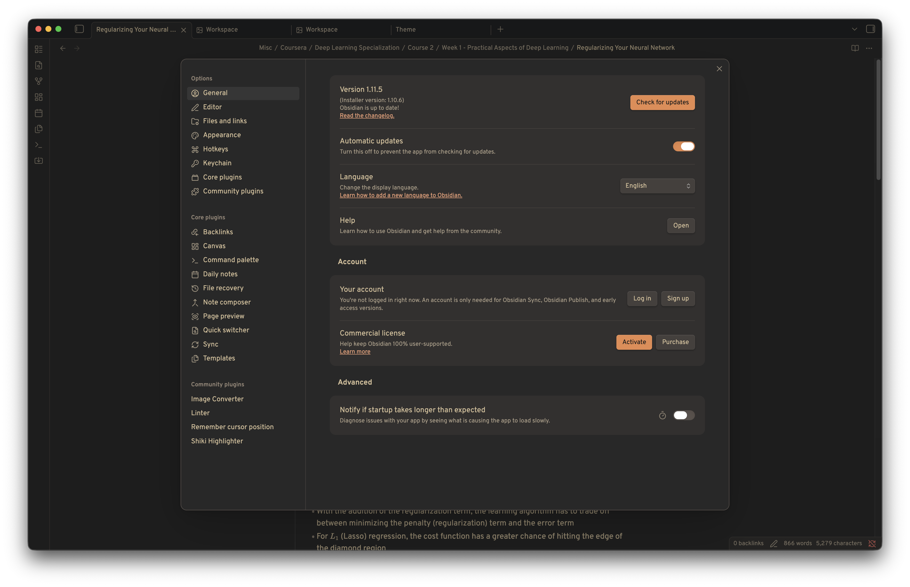

### Overview

Very minimal Gruvbox Material theme for Obsidian, customized to my taste. Inspired by [sainnhe/gruvbox-material](https://github.com/sainnhe/gruvbox-material) and [calvinchd's Firefox Gruvbox Dark Theme](https://addons.mozilla.org/en-US/firefox/addon/gruvbox-dark-theme/).

### Screenshots

*Colors*

*Latex*

*Canvas*

*Settings*
